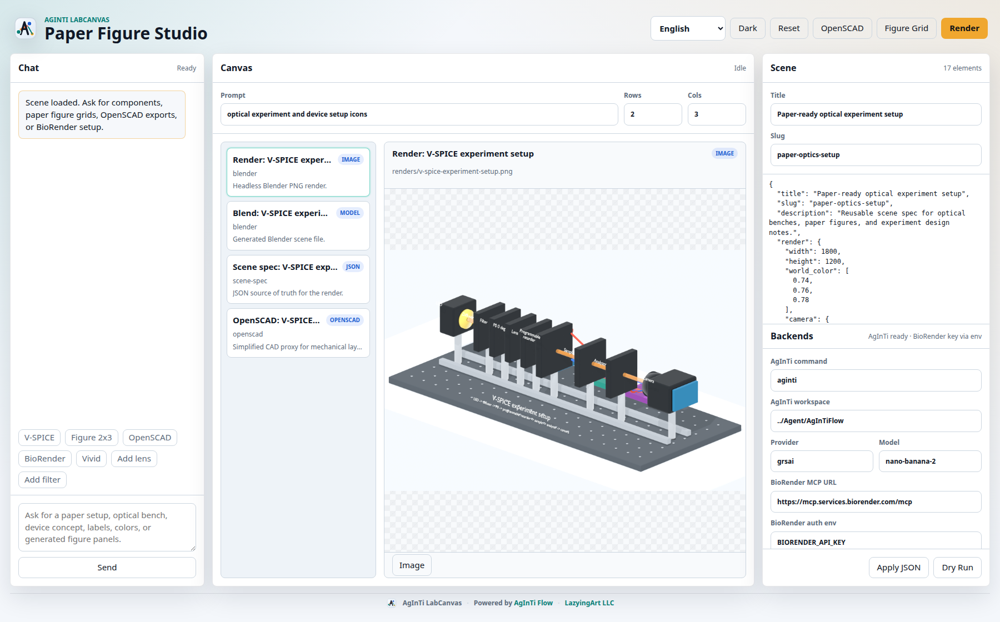

[English](README.md) · [العربية](i18n/README.ar.md) · [Español](i18n/README.es.md) · [Français](i18n/README.fr.md) · [日本語](i18n/README.ja.md) · [한국어](i18n/README.ko.md) · [Tiếng Việt](i18n/README.vi.md) · [中文 (简体)](i18n/README.zh-Hans.md) · [中文（繁體）](i18n/README.zh-Hant.md) · [Deutsch](i18n/README.de.md) · [Русский](i18n/README.ru.md)

[](https://lazying.art)

<p align="center">
  <a href="https://lazying.art"></a>
  <a href="https://github.com/lachlanchen/AgInTi-LabCanvas/actions"></a>
  
  
  
</p>

<h1 align="center">AgInTi LabCanvas</h1>

<p align="center">
  <strong>Editable scientific figure and experiment-design studio for agent workflows.</strong><br>
  Chat, preview, decompose, route, and rebuild paper figures through Blender, OpenSCAD, BioRender, AgInTi, KiCad, Unity, Unreal, and MCP-style tool bridges.
</p>

| Donate | PayPal | Stripe |
| --- | --- | --- |
| [](https://chat.lazying.art/donate) | [](https://paypal.me/RongzhouChen) | [](https://buy.stripe.com/aFadR8gIaflgfQV6T4fw400) |

<p align="center">
  
</p>

## What It Does

AgInTi LabCanvas is a small local control plane for agent-assisted scientific visuals and app automation. It keeps generated figures editable: an overview image can start an idea, but final outputs are rebuilt from atomic parts, scene specs, CAD files, manifests, and tool-specific artifacts.

## Current Highlights

| Area | What is ready | Entry point |
| --- | --- | --- |
| Web studio | Chat, bright UI, artifact canvas, backend settings, multilingual UI | `labcanvas web --port 8787 --open` |
| Paper figures | Exact `NxM` SVG grids, AgInTi image dry-run payloads, editable artifact manifest | [docs/EDITABLE_FIGURE_PIPELINE.md](docs/EDITABLE_FIGURE_PIPELINE.md) |
| 3D setup renders | JSON scene specs to Blender PNG and `.blend` output | [docs/SCENE_SPEC.md](docs/SCENE_SPEC.md) |
| CAD devices | OpenSCAD exports and C-mount reflector adapter CAD | [cad/README.md](cad/README.md) |
| Board/CAD tasks | Shared CLI and web-chat workflow for KiCad, OpenSCAD, renders, and manufacturing prep | [docs/BOARD_CAD_TASKS.md](docs/BOARD_CAD_TASKS.md) |
| PCB manufacturing | KiCad HYBEC and Lumileds boards, DRC/ERC, JLCPCB Gerber ZIPs | [pcb](pcb) |
| LabVIEW automation | Linux install probe, MCP candidate research, stdio-to-HTTP bridge | [agentic_tools/labview_mcp_agent](agentic_tools/labview_mcp_agent) |
| WeChat chatops | Isolated Linux GUI, direct local message mirror, fast ACK agent, AgInTi figure generation plus CAD/PCB/Blender worker queue, file/PDF/render return | [docs/WECHAT_AUTOMATION.md](docs/WECHAT_AUTOMATION.md) |
| App routing | Blender, BioRender, Unity, Unreal, and custom target dispatch | [docs/RESEARCH.md](docs/RESEARCH.md) |

## Quick Start

Run from a source checkout:

```bash
PYTHONPATH=src python -m agenticapp list
PYTHONPATH=src python -m agenticapp doctor
PYTHONPATH=src python -m agenticapp web --port 8787 --open
PYTHONPATH=src python -m agenticapp studio figure-grid "optical device icons 2x3" --rows 2 --cols 3
PYTHONPATH=src python -m agenticapp studio lab-task "prepare Lumileds no-resistor PCB and C-mount reflector CAD"
PYTHONPATH=src python -m unittest discover -s tests
```

The npm package has been renamed in this repository to `@lazyingart/labcanvas`, with `labcanvas` as the primary CLI and `app-auto-action` / `agenticapp` kept as compatibility aliases. The new npm package still needs a fresh authenticated publish; until then, use the source checkout or the previously published package name.

```bash
# After the renamed npm package is published:
npm install -g @lazyingart/labcanvas
labcanvas --version
labcanvas webapp start --port 19473
```

## Studio Workflow

1. Start with chat or a saved JSON scene spec.
2. Generate overview concepts through AgInTi image payloads or another image backend.
3. Split the figure into editable atoms: panels, icons, labels, CAD parts, renders, and TeX assembly layers.
4. Use BioRender for academic assets, OpenSCAD for mechanical layout, Blender for 3D setup renders, and KiCad for PCB artifacts.
5. Keep every artifact in the canvas manifest so later chat edits can target one part instead of flattening the whole figure.

## Example Commands

```bash
labcanvas scene-template experiment-setup --output my-setup.scene.json
labcanvas render-scene my-setup.scene.json --dry-run
labcanvas render-scene my-setup.scene.json --output-dir output/scenes
labcanvas studio openscad examples/paper-optics-setup.scene.json
labcanvas studio lab-task "prepare Lumileds no-resistor PCB and C-mount reflector CAD"
labcanvas studio lab-task "prepare Lumileds no-resistor PCB" --mode pcb --execute
labcanvas studio dispatch blender "Prepare an editable paper figure setup"
labcanvas wechat worker --chat "懒人科研" enqueue "Use AgInTi image generation to make a 2x3 microscopy icon figure"
labcanvas wechat worker --chat "懒人科研" enqueue "Use LabCanvas to render the Lumileds PCB and C-mount CAD preview"
labcanvas wechat status
labcanvas wechat hold start
labcanvas wechat stack start --web-port 19474
```

For a local Blender bridge test:

```bash
scripts/install_blender_portable.sh
labcanvas --config configs/blender-local-command.example.json doctor
labcanvas --config configs/blender-local-command.example.json dispatch blender "Draw a welcoming modern building with a tower"
```

## Architecture

```text
Agent / MCP client / CLI / web chat
        |
        | dry-run, render, export, dispatch
        v
AgInTi LabCanvas
        |
        | target registry + artifact manifest
        v
Blender · OpenSCAD · BioRender · AgInTi · KiCad · LabVIEW · Unity · Unreal
```

Every target dispatch receives a reviewable JSON envelope:

```json
{
  "target": "blender",
  "kind": "blender",
  "instruction": "Create a red cube at the origin",
  "payload": {},
  "metadata": {
    "source": "labcanvas"
  }
}
```

Copy `configs/targets.example.json` to `labcanvas.targets.json` for local ports, commands, and tokens. This override file is ignored by git.

## Validation

```bash
npm test
npm run pack:dry-run
PYTHONPATH=src python -m agenticapp doctor
```

Keep transport behavior covered by tests before adding live editor features. Review [SECURITY.md](SECURITY.md) before enabling live dispatch to editor bridges or browser sessions.
