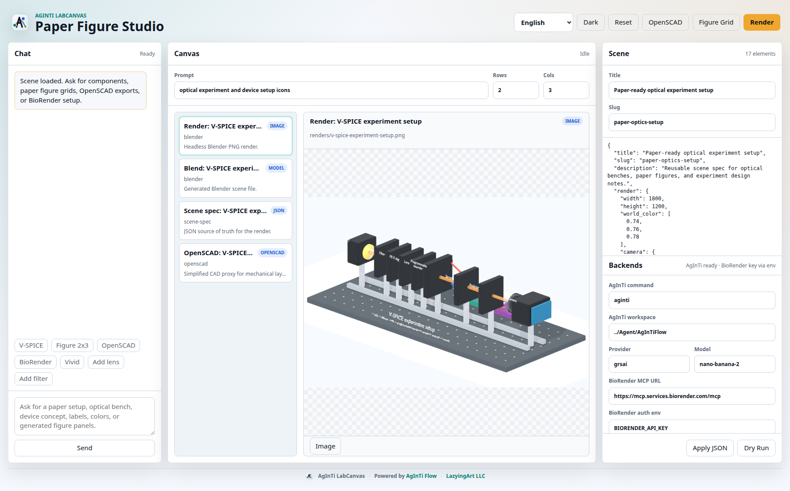

[English](README.md) · [العربية](i18n/README.ar.md) · [Español](i18n/README.es.md) · [Français](i18n/README.fr.md) · [日本語](i18n/README.ja.md) · [한국어](i18n/README.ko.md) · [Tiếng Việt](i18n/README.vi.md) · [中文 (简体)](i18n/README.zh-Hans.md) · [中文（繁體）](i18n/README.zh-Hant.md) · [Deutsch](i18n/README.de.md) · [Русский](i18n/README.ru.md)

[](https://lazying.art)

<p align="center">
  <a href="https://lazying.art"></a>
  <a href="https://github.com/lachlanchen/AgInTi-LabCanvas/actions"></a>
  
  
  
</p>

<h1 align="center">AgInTi LabCanvas</h1>

<p align="center">
  <strong>Editable scientific figure and experiment-design studio for agent workflows.</strong><br>
  Chat, preview, decompose, route, and rebuild paper figures through Blender, OpenSCAD, BioRender, AgInTi, KiCad, Unity, Unreal, and MCP-style tool bridges.
</p>

| Donate | PayPal | Stripe |
| --- | --- | --- |
| [](https://chat.lazying.art/donate) | [](https://paypal.me/RongzhouChen) | [](https://buy.stripe.com/aFadR8gIaflgfQV6T4fw400) |

<p align="center">
  
</p>

## What It Does

AgInTi LabCanvas is a small local control plane for agent-assisted scientific visuals and app automation. It keeps generated figures editable: an overview image can start an idea, but final outputs are rebuilt from atomic parts, scene specs, CAD files, manifests, and tool-specific artifacts.

## Current Highlights

| Area | What is ready | Entry point |
| --- | --- | --- |
| Workspace agent | Persistent direct chat, dynamic low-to-xhigh model routing, durable tasks, cancellation, and artifact return across all lab tools | [docs/WORKSPACE_AGENT.md](docs/WORKSPACE_AGENT.md) |
| Web studio | Agent chat, room-based persistent sessions, artifact canvas, backend settings, multilingual UI | `labcanvas web --port 8787 --open`, `/rooms` |
| Presentations | Editable manifest-driven PPTX, selective visual assets, generated-image policy gates, and PDF/PNG preview inspection | `labcanvas presentation`, [pipeline](docs/PRESENTATION_PIPELINE.md) |
| Paper figures | Exact `NxM` SVG grids, AgInTi image dry-run payloads, editable artifact manifest | [docs/EDITABLE_FIGURE_PIPELINE.md](docs/EDITABLE_FIGURE_PIPELINE.md) |
| Grant projects | Durable Codex goal workspace, traceable evidence, editable BioRender/SVG/TeX figures, checked LaTeX/PDF, and mandatory chat delivery | `labcanvas grant init`, `labcanvas grant run`, [BioRender bridge](agentic_tools/biorender_agent/README.md) |
| Protein structures | Reused ProteinStructure AlphaFold Server pipeline, persistent logged-in CDP/noVNC browser, downloads, metrics, plots, and screenshots | `labcanvas protein start`, [handoff](references/proteinstructure-alphafold-labcanvas-handoff.md) |
| 3D setup renders | JSON scene specs to Blender PNG and `.blend` output | [docs/SCENE_SPEC.md](docs/SCENE_SPEC.md) |
| CAD devices | OpenSCAD exports and C-mount reflector adapter CAD | [cad/README.md](cad/README.md) |
| Board/CAD tasks | Shared CLI and web-chat workflow for KiCad, OpenSCAD, renders, and manufacturing prep | [docs/BOARD_CAD_TASKS.md](docs/BOARD_CAD_TASKS.md) |
| PCB manufacturing | KiCad HYBEC and Lumileds boards, DRC/ERC, JLCPCB Gerber ZIPs | [pcb](pcb) |
| LabVIEW automation | Linux install probe, MCP candidate research, stdio-to-HTTP bridge | [agentic_tools/labview_mcp_agent](agentic_tools/labview_mcp_agent) |
| Android control | Dedicated noVNC/scrcpy desktop and ADB wrapper for the Mi MIX 2S real device plus matching AVD profile | [docs/ANDROID_DEVICE_CONTROL.md](docs/ANDROID_DEVICE_CONTROL.md) |
| WeChat chatops | Isolated Linux GUI, direct local message mirror, exact-token per-chat media isolation, serialized text/file delivery, bounded no-backlog recovery, and CAD/PCB/Blender artifact return | [docs/WECHAT_AUTOMATION.md](docs/WECHAT_AUTOMATION.md), [full control manual](agentic_tools/wechat_gui_agent/docs/FULL_CONTROL_MANUAL.md), [robust operations](agentic_tools/wechat_gui_agent/docs/ROBUST_EFFICIENT_OPERATIONS.md) |
| WeCom bridge | Official AI Bot and `wecom-cli` transports plus allowlisted GUI/Android relays, exact voice/media transcription, content-idempotent file sends, per-chat sessions, member archives, immediate `#daily` research, and LaTeX report recovery | [setup and architecture](docs/WECOM_API_BRIDGE.md), [stable GUI interface](agentic_tools/wecom_agent/docs/GUI_RELAY_INTERFACE.md) |
| LALACHAN video handoff | Story drafting, Xiaoyunque browser generation, MP4 download, repo/Nutstore copy, and LazyEdit permission gates for WeChat workers | [references/lalachan-story-video-handoff-for-wechat.md](references/lalachan-story-video-handoff-for-wechat.md) |
| Video publish handoff | Agents resolve exact videos and context, then delegate subtitle correction, metadata, logo/subtitle burn, packaging, and public posting to LazyEdit/AutoPublish | [references/lazyedit-agent-integration-handoff.md](references/lazyedit-agent-integration-handoff.md) |
| Social content agent | Persistent Codex campaigns, source-grounded platform drafts, SQLite history, Postiz/X MCP adapters, and exact-content publication approvals | [agentic_tools/social_content_agent](agentic_tools/social_content_agent) |
| App routing | Blender, BioRender, Unity, Unreal, and custom target dispatch | [docs/RESEARCH.md](docs/RESEARCH.md) |

## Quick Start

### Model Policy

Automatic LabCanvas turns use the shared [`configs/model-policy.json`](configs/model-policy.json):
AgInTiFlow is the primary persistent backend, with DeepSeek first and LocalLLM
as a same-session provider handoff. Established LabCanvas and sibling-project
routines remain the execution layer. Codex (`auto-code-review` or
`gpt-5.6-sol`) and Claude Code remain explicit opt-in compatibility backends;
explicit backend, model, and effort selections still win. See the
[AgInTi primary-agent handoff](references/aginti-primary-labcanvas-agent-handoff-2026-08-18.md)
for goal, context, artifact, fallback, and acceptance contracts.

Run from a source checkout:

```bash
PYTHONPATH=src python -m agenticapp list
PYTHONPATH=src python -m agenticapp doctor
PYTHONPATH=src python -m agenticapp web --port 8787 --open
PYTHONPATH=src python -m agenticapp agent capabilities
PYTHONPATH=src python -m agenticapp agent chat "Design and render a C-mount sensor holder"
PYTHONPATH=src python -m agenticapp grant run "Draft specific aims with verified evidence and an editable figure" --title "Research Grant" --dry-run
PYTHONPATH=src python -m agenticapp studio biorender-figure "Three-panel mechanism figure" --panel "A: mechanism" --panel "B: intervention" --panel "C: validation" --json
PYTHONPATH=src python -m agenticapp protein start --json
PYTHONPATH=src python -m agenticapp protein status --json
PYTHONPATH=src python -m agenticapp protein submit references/target.fasta --dry-run
PYTHONPATH=src python -m agenticapp studio figure-grid "optical device icons 2x3" --rows 2 --cols 3
PYTHONPATH=src python -m agenticapp studio lab-task "prepare Lumileds no-resistor PCB and C-mount reflector CAD"
PYTHONPATH=src python -m agenticapp wechat worker reprocess TASK_ID "recover completed report" --artifact-recovery-only --send --queue agentic_tools/wecom_agent/.private/wecom_task_queue.jsonl
PYTHONPATH=src python -m unittest discover -s tests
```

The npm package has been renamed in this repository to `@lazyingart/labcanvas`, with `labcanvas` as the primary CLI and `app-auto-action` / `agenticapp` kept as compatibility aliases. The new npm package still needs a fresh authenticated publish; until then, use the source checkout or the previously published package name.

`/rooms` provides persistent LabCanvas conversations backed by the same
workspace agent as the main Studio. The local owner can use the full normal
tool set. An invited participant is restricted to plan-only turns. In the
allowlisted WeCom `LabAgent` group, trusted members can request research,
editable figures, CAD/STEP/STL, PCB/KiCad/Gerber work, OpenSCAD, and Blender
renders; generated source and preview artifacts are returned to that exact
group. Public video publication is intentionally not available there.

```bash
# After the renamed npm package is published:
npm install -g @lazyingart/labcanvas
labcanvas --version
labcanvas webapp start --port 19473
```

## Studio Workflow

1. Start with chat or a saved JSON scene spec.
2. Generate overview concepts through AgInTi image payloads or another image backend.
3. Split the figure into editable atoms: panels, icons, labels, CAD parts, renders, and TeX assembly layers.
4. Use BioRender for academic assets, OpenSCAD for mechanical layout, Blender for 3D setup renders, and KiCad for PCB artifacts.
5. Keep every artifact in the canvas manifest so later chat edits can target one part instead of flattening the whole figure.

For visible end-to-end Studio control, start the isolated LabCanvas browser and use the reusable chat controller:

```bash
scripts/launch_labcanvas_studio_novnc.sh start
scripts/labcanvas_studio_browser.py chat --message "Design and validate a C-mount holder" --effort medium
```

This submits through the real composer, monitors the exact durable task, and saves browser evidence without sharing the WeChat or Xiaoyunque profiles. See [LabCanvas Studio Browser Control](references/labcanvas-studio-browser-control.md).

## Example Commands

```bash
labcanvas scene-template experiment-setup --output my-setup.scene.json
labcanvas agent chat "Create a clean Shapr3D-compatible optical holder" --model gpt-5.6-sol --effort medium
labcanvas agent chat "Inspect the current KiCad board and report problems" --mode plan
labcanvas agent tasks
labcanvas grant init "Draft a proposal grounded in the supplied call and primary literature" --title "Research Grant"
labcanvas grant run "Complete the proposal, editable figure, and checked PDF" --project-dir output/grants/PROJECT --effort medium
labcanvas grant validate --project-dir output/grants/PROJECT --json
labcanvas presentation init "Research roadmap" --objective "Explain the evidence and next experiment" --output-dir output/presentations/roadmap
labcanvas presentation build output/presentations/roadmap/presentation.json --render --json
labcanvas presentation validate output/presentations/roadmap/presentation.json --json
labcanvas render-scene my-setup.scene.json --dry-run
labcanvas render-scene my-setup.scene.json --output-dir output/scenes
labcanvas studio openscad examples/paper-optics-setup.scene.json
labcanvas studio lab-task "prepare Lumileds no-resistor PCB and C-mount reflector CAD"
labcanvas studio lab-task "prepare Lumileds no-resistor PCB" --mode pcb --execute
labcanvas studio dispatch blender "Prepare an editable paper figure setup"
labcanvas wechat worker --chat "懒人科研" enqueue "Use AgInTi image generation to make a 2x3 microscopy icon figure"
labcanvas wechat worker --chat "懒人科研" enqueue "Use LabCanvas to render the Lumileds PCB and C-mount CAD preview"
labcanvas wechat status
labcanvas wechat hold start
labcanvas wechat stack start --web-port 19474
labcanvas wechat career-agent start --send --attach-report --organize-report --organize-chat "写作 外语 挣钱"
labcanvas wechat career-agent organize --send --organize-chat "写作 外语 挣钱" --json
labcanvas wechat audio-intake --input <exact-local-media> --output-dir output/wechat-audio-read --json
labcanvas wechat shipinhao-transcribe --source-text-file <card.txt> --output-dir output/shipinhao-read --json
PYTHONPATH=src python agentic_tools/wecom_agent/scripts/wecom_daily_research.py run --json
PYTHONPATH=src python agentic_tools/wechat_gui_agent/scripts/echomind_language_scheduler.py --daily-pdf-now
labcanvas social project add --repo ../ZhJpBook --id pocketpolyglot
labcanvas social campaign create --project pocketpolyglot --name introduction --objective "Introduce the usable open-source Studio" --platform x --platform reddit:r/languagelearning --platform hackernews
labcanvas social draft generate CAMPAIGN_ID --dry-run --json
scripts/mix2s on --serial <MIX2S_SERIAL>
scripts/mix2s status --serial <MIX2S_SERIAL>
scripts/mix2s off --serial <MIX2S_SERIAL>
agentic_tools/android_device_agent/scripts/android_control.py status --serial <MIX2S_SERIAL>
agentic_tools/biorender_agent/scripts/start_biorender_stack.sh
python agentic_tools/biorender_agent/scripts/probe_biorender_mcp.py --json
```

For a local Blender bridge test:

```bash
scripts/install_blender_portable.sh
labcanvas --config configs/blender-local-command.example.json doctor
labcanvas --config configs/blender-local-command.example.json dispatch blender "Draw a welcoming modern building with a tower"
```

## Architecture

```text
Agent / MCP client / CLI / persistent web chat
        |
        | resumed session + dynamic policy + durable task
        v
AgInTi LabCanvas
        |
        | callable routines + target registry + artifact manifest
        v
Blender · OpenSCAD · BioRender · AgInTi · KiCad · LabVIEW · Unity · Unreal
```

Every target dispatch receives a reviewable JSON envelope:

```json
{
  "target": "blender",
  "kind": "blender",
  "instruction": "Create a red cube at the origin",
  "payload": {},
  "metadata": {
    "source": "labcanvas"
  }
}
```

Copy `configs/targets.example.json` to `labcanvas.targets.json` for local ports, commands, and tokens. This override file is ignored by git.

## Validation

```bash
npm test
npm run pack:dry-run
PYTHONPATH=src python -m agenticapp doctor
```

Keep transport behavior covered by tests before adding live editor features. Review [SECURITY.md](SECURITY.md) before enabling live dispatch to editor bridges or browser sessions.
