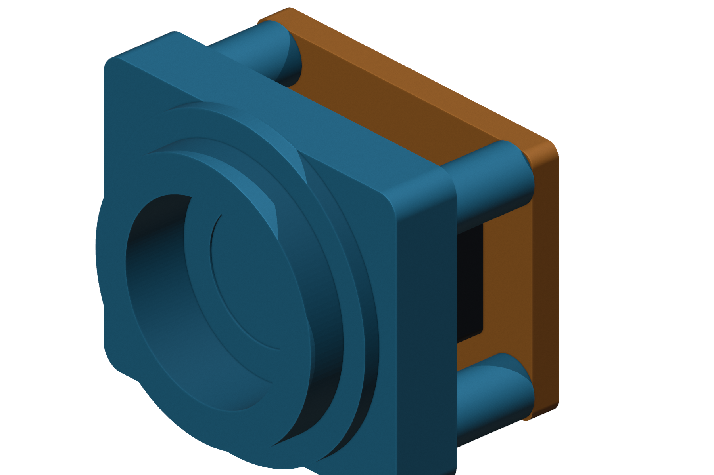
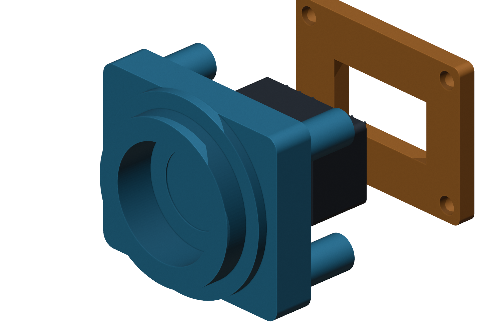

# C12880MA C-Mount-Side 25 mm Pilot Holder

This project is a new independent LabCanvas CAD design for holding a bare
Hamamatsu C12880MA mini-spectrometer behind a C-mount-side optical interface.
The optical axis runs from the smooth pilot on the left/front toward the sensor
slit on the right/rear.





## Source Review

The downloaded vendor package was inspected without running `wave_main.exe` or
`WinRAR V3.exe`. Its `CCD3D.stp` models the approximately 68 x 49 mm controller
PCB, SMA connectors, USB-C connector, and board-to-board connectors. It does not
model the separate C12880MA optical head. The vendor manual also states that the
driver PCB and spectrometer sensor are installed separately and connected by a
15 cm cable.

The sensor pocket is therefore based on Hamamatsu's official dimensional
drawing rather than on a connector incorrectly extracted from the controller
STEP model.

## Mechanical Architecture

- Left/front: smooth external `25.0 mm` locating pilot, `5.0 mm` long.
- Center: stepped `18 -> 12 -> 5 mm` optical baffle.
- Right/rear: keyed C12880MA pocket with `0.20 mm` clearance per side.
- Rear: separate orange retainer with an open lead window.
- Four fixed-length standoffs prevent the retainer from crushing the hermetic
  package.
- Four M2.5 positions use `2.8 mm` retainer clearance holes and `2.2 mm`
  printable body pilot holes.

The sensor pocket is shifted by `-0.5 mm` so the slit position aligns with the
pilot axis. The `5 mm` final aperture clears the official `3.2 mm` entrance
opening while retaining material around the sensor face.

## Critical Dimensions

| Feature | Value |
| --- | ---: |
| Smooth external pilot | 25.0 mm diameter |
| Pilot length | 5.0 mm |
| Sensor package | 20.12 x 12.5 x 10.12 mm |
| Sensor pocket | 20.52 x 12.90 mm |
| Entrance opening | 3.2 mm diameter |
| Slit | 0.05 x 0.5 mm |
| Retainer | 32 x 24 x 2.8 mm |
| Lead window | 18 x 9.5 mm |
| Sensor axial clearance | 0.25 mm |

## Important C-Mount Note

The requested `25 mm` feature is implemented as a smooth external pilot. It is
not a real C-mount thread. A standard C-mount lens uses a nominal 1 inch-32 UN
thread (25.4 mm major diameter). Do not force a threaded C-mount lens onto this
pilot. If direct lens threading is required, replace the pilot with a machined
1-32 insert or make a calibrated threaded variant.

## Electrical and Handling Constraint

The C12880MA package is electrically conductive and connected to pin 5. Print
the body and retainer in insulating polymer. Any metal part touching the case
must be insulated or held at the same potential as pin 5. Do not clamp the lead
pins, and use a thin compliant pad only if the first fit shows axial play.

## Outputs

| Output | Path |
| --- | --- |
| Printable optical body STEP | `artifacts/c12880ma_cmount_25mm_pilot_holder_body.step` |
| Printable optical body STL | `artifacts/c12880ma_cmount_25mm_pilot_holder_body.stl` |
| Rear retainer STEP | `artifacts/c12880ma_cmount_25mm_pilot_holder_retainer.step` |
| Rear retainer STL | `artifacts/c12880ma_cmount_25mm_pilot_holder_retainer.stl` |
| Sensor proxy STEP/STL | `artifacts/c12880ma_cmount_25mm_pilot_holder_sensor_proxy.*` |
| Fit-check assembly STEP/STL | `artifacts/c12880ma_cmount_25mm_pilot_holder_assembly.*` |
| Dimension sketch | `artifacts/c12880ma_cmount_25mm_pilot_holder_dimension_sketch.{svg,png,pdf}` |
| Assembled render | `artifacts/c12880ma_cmount_25mm_pilot_holder_assembled_render.png` |
| Side alignment render | `artifacts/c12880ma_cmount_25mm_pilot_holder_side_alignment_render.png` |
| Exploded render | `artifacts/c12880ma_cmount_25mm_pilot_holder_exploded_render.png` |
| Blender inspection scene | `artifacts/c12880ma_cmount_25mm_pilot_holder.blend` |
| Parameter/output manifest | `artifacts/manifest.json` |

## Build

The isolated command below avoids changing the repository Python environment:

```powershell
uv run --with cadquery --with cairosvg python cad/designs/c12880ma_cmount_25mm_pilot_holder/build_c12880ma_cmount_25mm_pilot_holder.py
```

Render with Blender:

```powershell
& "C:\Program Files\Blender Foundation\Blender 5.1\blender.exe" --background --python cad/designs/c12880ma_cmount_25mm_pilot_holder/render_c12880ma_cmount_25mm_pilot_holder.py
```

Print a short pilot-fit coupon or the body alone before committing to the full
assembly. Printed pilot diameter depends on material, nozzle, orientation, and
printer calibration.

## Primary References

- [Hamamatsu C12880MA product page](https://www.hamamatsu.com/us/en/product/optical-sensors/spectrometers/mini-spectrometer/C12880MA.html)
- [Hamamatsu C12880MA/C16767MA official datasheet](https://hub.hamamatsu.com/content/dam/hamamatsu-photonics/sites/documents/99_SALES_LIBRARY/ssd/c12880ma_c16767ma_kacc1226e.pdf)

The official datasheet is the authority for the package, slit, pin geometry,
electrical case warning, and tolerances. This holder remains a printable first
fit and should be checked against the physical sensor before machining.
