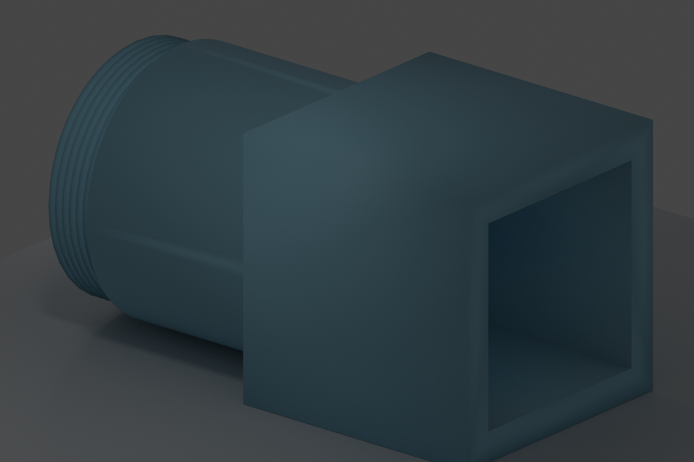
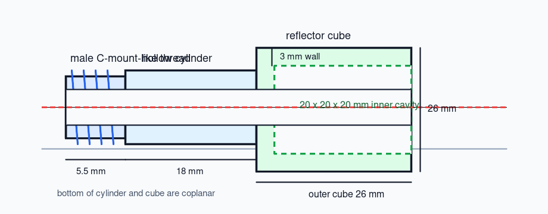

# C-Mount Reflector Adapter

This is a first editable draft for a 4f-system adapter: male C-mount-like thread on one side, hollow optical tube through the center, and a 20 x 20 x 20 mm internal reflector cube on the other side.





## Files

- `cmount_reflector_adapter.scad`: parametric OpenSCAD model.
- `adapter_cross_section.svg`: dimension sketch for review.
- `artifacts/adapter_cross_section.png`: PNG preview generated from the SVG sketch.
- `artifacts/adapter_render_3d.png`: generated 3D preview from the same 1:1 dimensions.
- `artifacts/adapter_render_full_scale.png`: zoomed-out 3D preview.
- `artifacts/adapter_render_blender.png`: Blender/Cycles render from the generated STL.
- `artifacts/cmount_reflector_adapter.stl`: OpenSCAD-exported printable mesh.
- `artifacts/cmount_reflector_adapter.blend`: Blender scene used for the render.
- `render_preview.py`: Matplotlib preview helper used when OpenSCAD is unavailable.
- `blender_render.py`: headless Blender render helper for STL previews.

## Key Parameters

- External thread default: `24.4 mm` major diameter, matching the local STEP reference label `Thread camera 24.4`.
- Nominal C-mount reference: `25.4 mm`, `32 TPI`, `0.79375 mm` pitch.
- Bore diameter: `20 mm`.
- Reflector cavity: `20 x 20 x 20 mm`.
- Cube wall: `3 mm`, giving a `26 x 26 x 26 mm` outside cube.
- Body cylinder diameter: `26 mm`, so the cylinder bottom and cube bottom lie on the same plane.
- Total 1:1 bounding size: `49.5 x 26 x 26 mm`.
- STL validation: watertight, one connected mesh by Trimesh, `49.5 x 26.0 x 26.0 mm` bounds.

Detailed scale checks are tracked in `../../references/cmount-reflector-adapter-scale.md`.

## Usage

Open the model in OpenSCAD:

```bash
openscad cad/designs/cmount_reflector_adapter/cmount_reflector_adapter.scad
```

Export when OpenSCAD is installed:

```bash
openscad -o output/cad/cmount_reflector_adapter.stl cad/designs/cmount_reflector_adapter/cmount_reflector_adapter.scad
```

Render the current STL with Blender:

```bash
blender --background --python cad/designs/cmount_reflector_adapter/blender_render.py
```

Before printing the full device, print only the male thread section and test it against the target female C-mount. Tune `thread_major_d`, `thread_depth`, and `clearance` in small increments.

## Status

This is a mechanical draft, not a metrology-grade thread model. It is suitable for iterative 3D-print fitting. For machined metal, replace the approximate OpenSCAD thread with a proper 1.000"-32 UN-2A thread defined in CAD/CAM.
