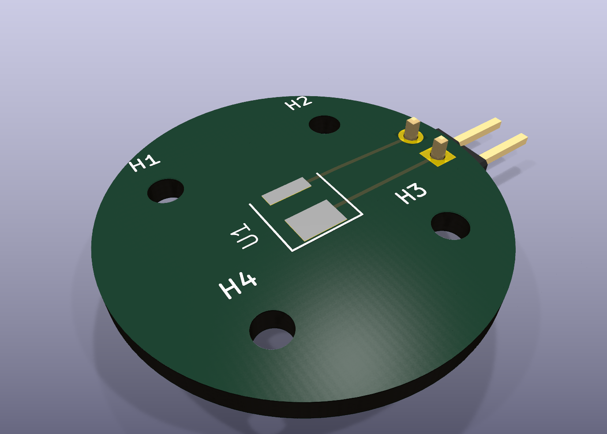

# Lumileds No-Resistor PCB

Sibling board to `pcb/hybec-hbl-273-g4`, derived from the historical Lumileds reference board at
`pcb/nhi-pcb/nhi-pcb/leds/lumileds`.

This version keeps the same 24 mm circular outline, four M2 mounting holes, `LXCL_MN08_4000`
Lumileds footprint, and horizontal 1x2 power header. The original `R1` 1.8 ohm 0201 series
resistor is removed; `J1 Pin_2` routes directly to `U1 VCC`.



## Files

- `lumileds-no-resistor.kicad_pcb` - KiCad board.
- `lumileds-no-resistor.kicad_sch` - matching schematic with no resistor symbol.
- `lumileds-no-resistor.csv` - BOM without `R1`.
- `generate_lumileds_no_resistor_board.py` - deterministic generator from the reference design.
- `fp-lib-table`, `sym-lib-table`, `footprints.pretty/`, `symbols.kicad_sym` - local library bindings.
- `artifacts/` - ERC/DRC reports, STEP export, and rendered previews.
- `gerber/` - Gerber and drill files for fabrication review.
- `jlcpcb_order/` - JLCPCB ZIP, manifest, board-order config, and order notes.
- `GENERATION_AND_ORDER_LOG.md` - detailed generation, validation, and JLC automation log.

## Validation Status

- KiCad CLI 10.0.3.
- ERC: 0 violations.
- DRC: 0 unconnected items; 5 warnings remain from copied reference geometry (`lib_footprint_mismatch` x2 and connector silkscreen clipped by the circular board edge x3).
- STEP export uses the installed KiCad 10 pin-header model at `/usr/share/kicad/3dmodels/...Horizontal.step`.

## Validate

```bash
kicad-cli sch erc --format json --severity-all -o artifacts/erc.json lumileds-no-resistor.kicad_sch
kicad-cli pcb drc --format json --severity-all -o artifacts/drc.json lumileds-no-resistor.kicad_pcb
kicad-cli pcb export step --force --include-pads --include-tracks --include-silkscreen --include-soldermask -o artifacts/lumileds-no-resistor.step lumileds-no-resistor.kicad_pcb
kicad-cli pcb export gerbers --layers F.Cu,B.Cu,F.SilkS,B.SilkS,F.Mask,B.Mask,Edge.Cuts,F.Fab,B.Fab --precision 6 -o gerber lumileds-no-resistor.kicad_pcb
kicad-cli pcb export drill --generate-map --map-format svg --generate-report --report-path artifacts/drill-report.txt -o gerber lumileds-no-resistor.kicad_pcb
xvfb-run -a kicad-cli pcb render --output artifacts/lumileds-no-resistor-render-full.png --width 1400 --height 1000 --background opaque --quality high --floor --perspective --rotate 315,0,35 --zoom 0.95 lumileds-no-resistor.kicad_pcb
```

## JLCPCB

The JLC order pack is in `jlcpcb_order/`. The China web order flow submitted this
board for review on 2026-06-15; payment was not made by automation.
