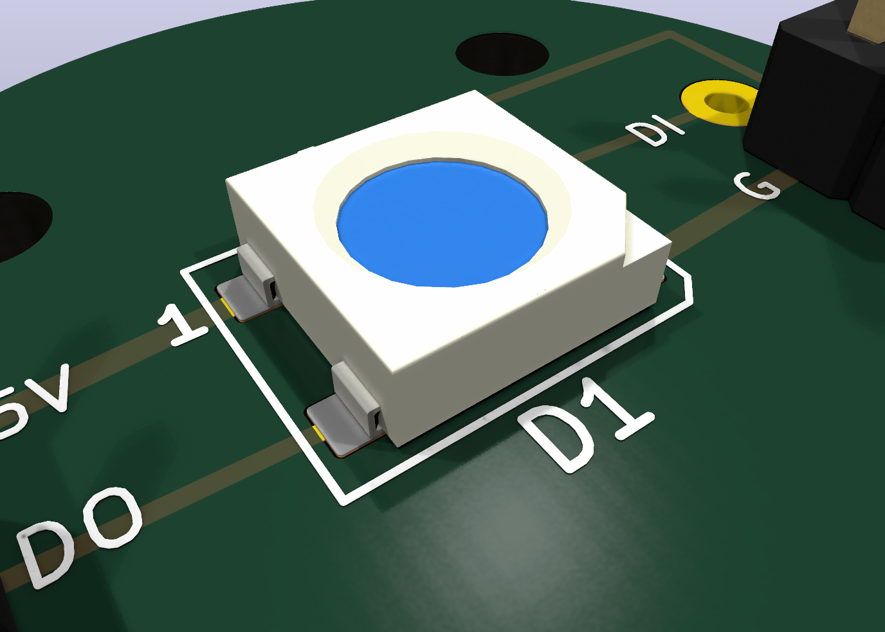
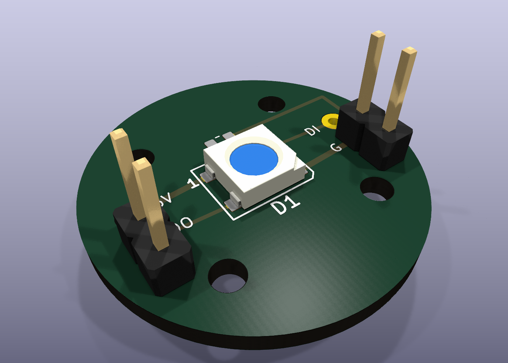

# SK6812RGBW 5050 RGBW LED Carrier PCB





This generated KiCad project adapts the existing 24 mm round LED carrier style
to a single SK6812RGBW 5050 addressable RGBW LED. The footprint uses the local
5050 SK6812 pad geometry with the SK6812RGBW datasheet pinout.

- Board outline: 24 mm circular carrier.
- Mounting: four M2 NPTH holes on a 12 x 12 mm pattern.
- LED: SK6812RGBW 5050 PLCC-4, centered on the board.
- Headers: two 1x02 2.54 mm side connectors. Left side is `DOUT`/`5V`;
  right side is `GND`/`DIN`.
- `DIN` is routed directly to the LED for a cleaner single-LED carrier. Add an
  external 220-470 ohm series resistor only when the controller lead is long or
  noisy.
- Local supply stability: `0.1 uF` 0603 capacitor close to LED `VDD`/`VSS`.

## Datasheet Notes

The SK6812RGBW datasheet identifies the package as a 5.5 x 5.0 x 1.6 mm
integrated RGBW LED and controller. The pinout used here is:

1. `VDD`
2. `DOUT`
3. `VSS`
4. `DIN`

Run it from a nominal 5 V supply. The RGBW protocol is a single-wire 800 kHz,
32-bit stream. If the controller is 3.3 V logic while the LED is powered at 5 V,
use a level shifter or verify that `DIN` meets the datasheet input threshold.
KiCad's generic `SK6812` symbol maps pins differently, so this board intentionally
uses the RGBW datasheet pinout above.

## Files

- `sk6812rgbw-5050-rgbw-led.kicad_pcb`: generated KiCad PCB.
- `sk6812rgbw-5050-rgbw-led-dataset.json`: source assumptions and dimensions.
- `references/`: downloaded datasheet copies when available.
- `artifacts/sk6812rgbw-5050-rgbw-led-render.png`: close KiCad render.
- `artifacts/sk6812rgbw-5050-rgbw-led-render-full.png`: full-board render.
- `artifacts/sk6812rgbw-5050-rgbw-led.step`: KiCad STEP export.
- `gerber/`: Gerber and Excellon drill outputs.
- `jlcpcb_order/`: optional JLC bare-board order package.

## Reproduce

```bash
python3 pcb/scripts/generate_sk6812rgbw_5050_rgbw_board.py
kicad-cli sch erc --format json --severity-all -o pcb/sk6812rgbw-5050-rgbw-led/artifacts/erc.json pcb/sk6812rgbw-5050-rgbw-led/sk6812rgbw-5050-rgbw-led.kicad_sch
kicad-cli pcb drc --format json --severity-all -o pcb/sk6812rgbw-5050-rgbw-led/artifacts/drc.json pcb/sk6812rgbw-5050-rgbw-led/sk6812rgbw-5050-rgbw-led.kicad_pcb
kicad-cli pcb export gerbers --layers F.Cu,B.Cu,F.SilkS,B.SilkS,F.Mask,B.Mask,Edge.Cuts,F.Fab,B.Fab --precision 6 -o pcb/sk6812rgbw-5050-rgbw-led/gerber pcb/sk6812rgbw-5050-rgbw-led/sk6812rgbw-5050-rgbw-led.kicad_pcb
kicad-cli pcb export drill --generate-map --map-format svg --generate-report --report-path pcb/sk6812rgbw-5050-rgbw-led/artifacts/drill-report.txt -o pcb/sk6812rgbw-5050-rgbw-led/gerber pcb/sk6812rgbw-5050-rgbw-led/sk6812rgbw-5050-rgbw-led.kicad_pcb
```
