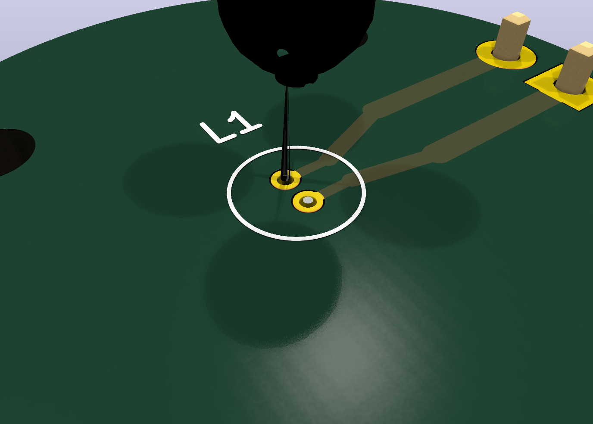
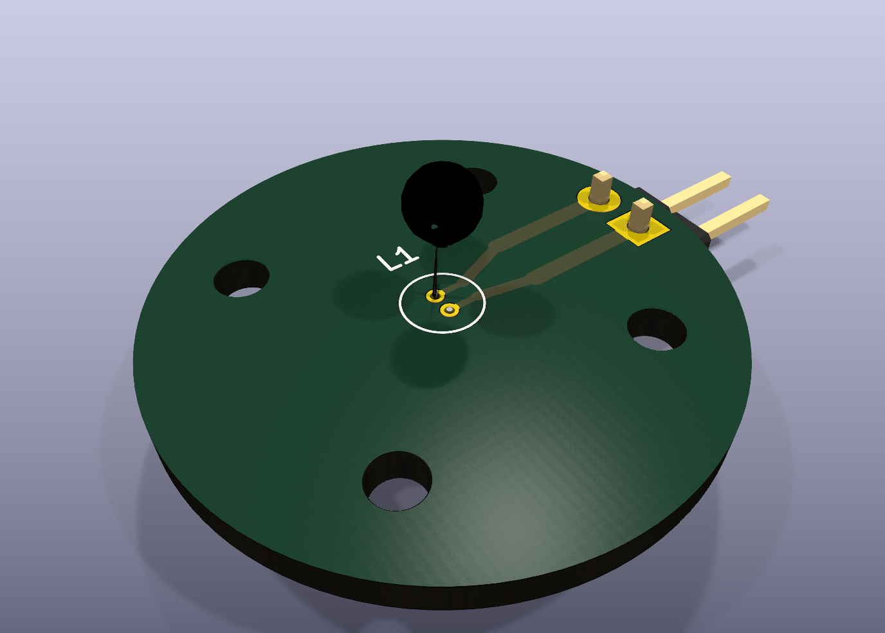

# 3 mm 5 V 400 mA Tungsten Lamp Carrier PCB





This generated KiCad project adapts the existing 24 mm round LED/lamp carrier
style to a very small non-polar tungsten filament lamp:

- Lamp listing: `2 W, 5 V, 400 mA, non-polar, 3 mm bulb, warm yellow`.
- Lead diameter: `0.25 mm`.
- Lead pitch: `1.00 mm`.
- PCB lamp holes: `0.45 mm` plated through holes on `1.00 mm` pitch.
- Lamp pads: `0.75 mm` diameter, leaving about `0.25 mm` copper-to-copper gap.
- Power path: short direct traces from the 1x02 input header, no resistor.
- Board outline: 24 mm circular carrier with four M2 mounting holes.

The drill is intentionally larger than the 0.25 mm foot so it is easier for JLC
to fabricate and easier to solder by hand. Verify fit with the actual lamp
before ordering a large quantity.

## Files

- `tungsten-5v-400ma-3mm.kicad_pcb`: generated KiCad PCB.
- `japan-tungsten-5v-400ma-3mm-lamp-dataset.json`: source assumptions and dimensions.
- `3dmodels/Japan_Tungsten_3mm_5V_400mA.step`: simple inspection proxy for the lamp.
- `artifacts/tungsten-5v-400ma-3mm-render.png`: close KiCad render.
- `artifacts/tungsten-5v-400ma-3mm-render-full.png`: full-board render.
- `artifacts/tungsten-5v-400ma-3mm.step`: KiCad STEP export.
- `gerber/`: Gerber and Excellon drill outputs.
- `jlcpcb_order/`: JLC China order package and settings.

## Thermal And Electrical Notes

- A 2 W tungsten bulb can still heat the PCB and nearby printed holder.
- Use direct 5 V supply. Do not add a series resistor unless the lamp sample
  behaves differently from the listing.
- Because the lamp is non-polar, the two lamp pads are named A/B only for routing.
- Keep the lamp body lifted above FR4 if the real sample radiates too much heat.

## Reproduce

```bash
python3 pcb/scripts/generate_tungsten_5v_400ma_board.py
kicad-cli sch erc --format json --severity-all -o pcb/tungsten-5v-400ma-3mm/artifacts/erc.json pcb/tungsten-5v-400ma-3mm/tungsten-5v-400ma-3mm.kicad_sch
kicad-cli pcb drc --format json --severity-all -o pcb/tungsten-5v-400ma-3mm/artifacts/drc.json pcb/tungsten-5v-400ma-3mm/tungsten-5v-400ma-3mm.kicad_pcb
kicad-cli pcb export gerbers --layers F.Cu,B.Cu,F.SilkS,B.SilkS,F.Mask,B.Mask,Edge.Cuts,F.Fab,B.Fab --precision 6 -o pcb/tungsten-5v-400ma-3mm/gerber pcb/tungsten-5v-400ma-3mm/tungsten-5v-400ma-3mm.kicad_pcb
kicad-cli pcb export drill --generate-map --map-format svg --generate-report --report-path pcb/tungsten-5v-400ma-3mm/artifacts/drill-report.txt -o pcb/tungsten-5v-400ma-3mm/gerber pcb/tungsten-5v-400ma-3mm/tungsten-5v-400ma-3mm.kicad_pcb
```
