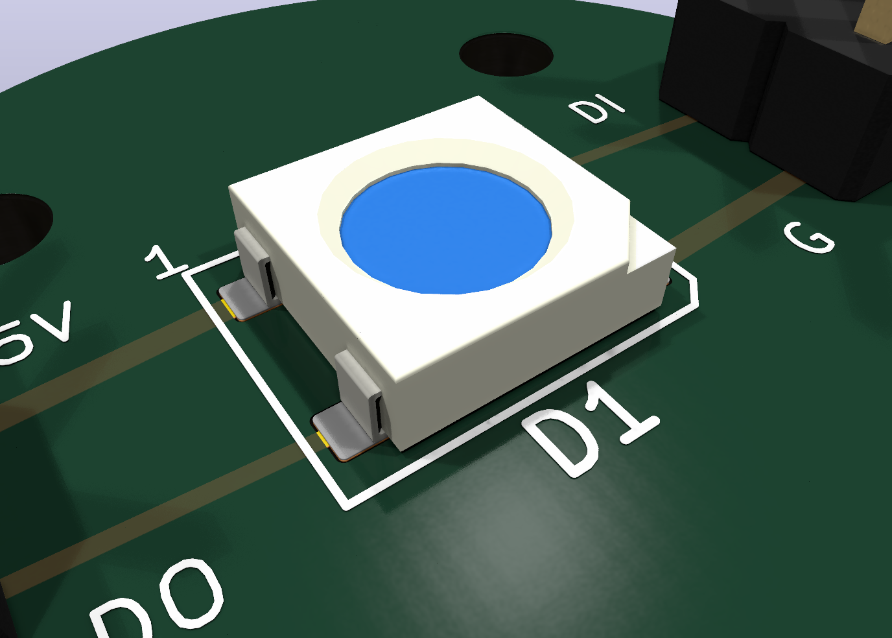
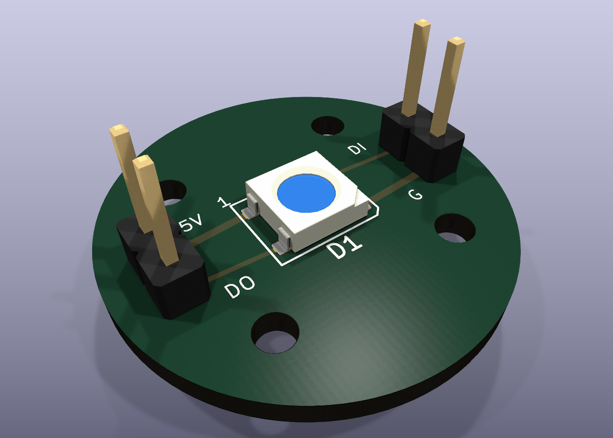
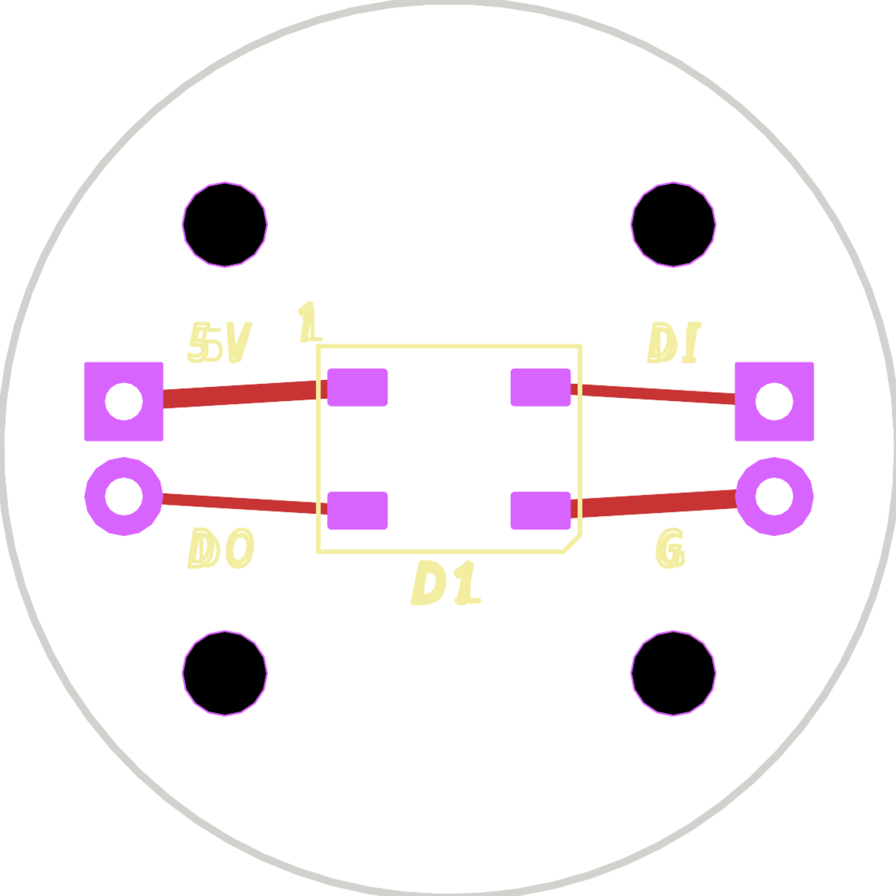

# WS2812B 5050 RGB LED Carrier PCB







This generated KiCad project adapts the existing 24 mm round LED carrier style
to a single WS2812B 5050 addressable RGB LED.

- Board outline: 24 mm circular carrier.
- Mounting: four M2 NPTH holes on a 12 x 12 mm pattern.
- LED: WS2812B 5050 PLCC-4, centered on the board.
- Headers: two 1x02 2.54 mm side connectors. Left side is `DOUT`/`5V`;
  right side is `GND`/`DIN`.
- `DIN` is routed directly to the LED for a cleaner single-LED carrier. Add an
  external 220-470 ohm series resistor only when the controller lead is long or
  noisy.
- Top copper is intentionally simple: one visible route for each LED foot
  (`VDD`, `DOUT`, `GND`, `DIN`).
- Local supply stability: `0.1 uF` 0603 capacitor on `B.Cu`; it connects from
  the back side through the side header pads so it does not appear as another
  LED leg on the top render.

## Datasheet Notes

The WS2812B datasheet identifies the package as a 5050 integrated RGB LED and
controller. The pinout used here is:

1. `VDD`
2. `DOUT`
3. `VSS`
4. `DIN`

Run it from a nominal 5 V supply. If the controller is 3.3 V logic while the LED
is powered at 5 V, use a level shifter or verify that the DIN high level still
meets the datasheet threshold.

## Files

- `ws2812b-5050-rgb-led.kicad_pcb`: generated KiCad PCB.
- `ws2812b-5050-rgb-led-dataset.json`: source assumptions and dimensions.
- `references/`: downloaded datasheet copies when available.
- `artifacts/ws2812b-5050-rgb-led-render.png`: close KiCad render.
- `artifacts/ws2812b-5050-rgb-led-render-full.png`: full-board render.
- `artifacts/ws2812b-5050-rgb-led-plain-top.png`: flat top copper and
  silkscreen plot without 3D component bodies.
- `artifacts/ws2812b-5050-rgb-led.step`: KiCad STEP export.
- `gerber/`: Gerber and Excellon drill outputs.
- `jlcpcb_order/`: optional JLC bare-board order package.

## Reproduce

```bash
python3 pcb/scripts/generate_ws2812b_5050_rgb_board.py
kicad-cli sch erc --format json --severity-all -o pcb/ws2812b-5050-rgb-led/artifacts/erc.json pcb/ws2812b-5050-rgb-led/ws2812b-5050-rgb-led.kicad_sch
kicad-cli pcb drc --format json --severity-all -o pcb/ws2812b-5050-rgb-led/artifacts/drc.json pcb/ws2812b-5050-rgb-led/ws2812b-5050-rgb-led.kicad_pcb
kicad-cli pcb export gerbers --layers F.Cu,B.Cu,F.SilkS,B.SilkS,F.Mask,B.Mask,Edge.Cuts,F.Fab,B.Fab --precision 6 -o pcb/ws2812b-5050-rgb-led/gerber pcb/ws2812b-5050-rgb-led/ws2812b-5050-rgb-led.kicad_pcb
kicad-cli pcb export drill --generate-map --map-format svg --generate-report --report-path pcb/ws2812b-5050-rgb-led/artifacts/drill-report.txt -o pcb/ws2812b-5050-rgb-led/gerber pcb/ws2812b-5050-rgb-led/ws2812b-5050-rgb-led.kicad_pcb
```
